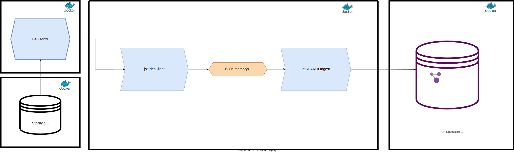

# LDES consumption pipeline

This system component is a [RDF-Connect](https://rdf-connect.github.io/rdfc.github.io/)-based pipeline that reads data events from [Linked Data Event Stream (LDES)](https://w3id.org/ldes/specification) and writes them into a target RDF graph store.

In this particular case, we define a pipeline using a CA processor that encapsulates this [LDES client](https://github.com/rdf-connect/ldes-client) implementation, and writes all extracted entity updates into a [Virtuoso](https://github.com/openlink/virtuoso-opensource) RDF graph store (see the [rdf-graph-store folder](https://github.com/rdf-connect/RDF-Connect-RINF-LDES/blob/main/rdf-graph-store/README.md)). Next, a schematic view of this pipeline is shown followed by a description of each processor.



This diagram corresponds to the pipeline description found at [`rdfc-pipeline.ttl`](https://github.com/rdf-connect/RDF-Connect-RINF-LDES/blob/main/consumption-pipeline/rdfc-pipeline.ttl).

## Processors

This pipeline use 2 CA processors:

- [**js:LdesClient**](https://github.com/rdf-connect/ldes-client/blob/main/processor.ttl): This processor encapsulates [this TypeScript implementation](https://github.com/rdf-connect/ldes-client) of an LDES client, which allows to replicate and synchronize with any LDES over the Web. In this case, we use it to replicate and track the changes published by the RINF LDES, published by the [generation pipeline](https://github.com/rdf-connect/RDF-Connect-RINF-LDES/blob/main/generation-pipeline/README.md). [One instance](https://github.com/rdf-connect/RDF-Connect-RINF-LDES/blob/main/consumption-pipeline/rdfc-pipeline.ttl#L39) of this processor is defined in the consumption pipeline.

- [**js:SPARQLIngest**](https://github.com/rdf-connect/sparql-ingest-processor-ts?tab=readme-ov-file#jssparqlingest): This processor takes a stream of entities/members described by the [SDS metadata](https://treecg.github.io/SmartDataStreams-Spec/), and generates SPARQL Update queries that are executed in a pre-configured target RDF graph store. Additional configuration can be given to specify the semantics (property and values) of specific changes (i.e., creations, updates and deletions). Furthermore, a set of SHACL shapes can be provided to the processor to define properly SPARQL DELETE queries of entities that don't carry all their properties. [One instance](https://github.com/rdf-connect/RDF-Connect-RINF-LDES/blob/main/consumption-pipeline/rdfc-pipeline.ttl#L48) of this processor is defined in the consumption pipeline.

## Run it with Docker

First build a container from the [`Dockerfile`](https://github.com/rdf-connect/RDF-Connect-RINF-LDES/blob/main/consumption-pipeline/Dockerfile) present in this repository:

```bash
docker build -t consumption-pipeline .
```

Then execute the container as follows:

```bash
docker run --volume={STATE_PATH}:/opt/consumption-pipeline/state consumption-pipeline
```

Replace `{STATE_PATH}` by the local path on disk, where the state of the LDES client will be persisted.
