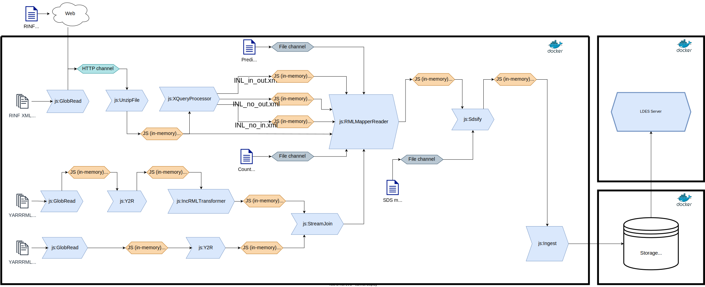

# LDES generation pipeline

This system component is a [Connector Architecture](https://the-connector-architecture.github.io/site/docs/1_Home)-based pipeline that performs a set of data transformations to create a [Linked Data Event Stream (LDES)](https://w3id.org/ldes/specification).

In this particular case, the pipeline's main goal is to transform the original RINF data, which is given in the form of XML documents following the [RINF XSD schema](https://www.era.europa.eu/system/files?file=2022-11/rinf_schema_en.xsd), into a RDF representation of the data, according to the [ERA Vocabulary](https://data-interop.era.europa.eu/era-vocabulary/). Furthermore, the resulting RDF data is targeted to be published in the form of a LDES, which entails creating versioned instances of a predefined set of classes as specified in the data model at hand (i.e., the ERA Vocabulary). A schematic overview of the complete pipeline can be seen next, followed by a detailed description of every step in the workflow.



This diagram corresponds to the CA pipeline described by [`pipeline/ca-pipeline-init.ttl`](https://github.com/julianrojas87/CA-RINF-LDES/blob/main/generation-pipeline/ca-pipeline-init.ttl). A visualization of [`pipeline/ca-pipeline.ttl`](https://github.com/julianrojas87/CA-RINF-LDES/blob/main/generation-pipeline/ca-pipeline.ttl) would be the same, except for the `RINF-XML (initial set of data)` and the related `js:GlobRead` processor.

## Input data

This workflow start its operation with a set of initial data sources and configuration files:

- **RINF XML (initial set)**: This is the initial set of data sources, containing the information of the EU railway infrastructure. Each file contains a subset of the network as provided by the different infrastructure managers across the member states. This initial set of data sources starts being processed immediately after the workflow is initiated.
- **Predicate Index (CSV)**: A [static CSV file](https://github.com/julianrojas87/CA-RINF-LDES/blob/main/generation-pipeline/rawdata/index_predicate_mappings.csv) containing an alignment between the different predicate IRIs of the ERA vocabulary and the corresponding index codes according to the [RINF application guide](https://www.era.europa.eu/system/files/2023-02/RINF%20Application%20guide%20V1.6.1.pdf). This file is read once at workflow start.
- **Countries (CSV)** A [static CSV file](https://github.com/julianrojas87/CA-RINF-LDES/blob/main/generation-pipeline/rawdata/countries.csv) containing an alignment between country codes and their corresponding IRI as defined by the EU Publications Office's [authority table](https://op.europa.eu/en/web/eu-vocabularies/dataset/-/resource?uri=http://publications.europa.eu/resource/dataset/country). This file is read once at workflow start.
- **YARRRML mappings (versioned)**: [YARRRML mapping documents](https://github.com/julianrojas87/CA-RINF-LDES/tree/main/mappings/versioned) containing the generation rules of all the entities that will be versioned and considered members of the target LDES. The versioned entity types include `era:NationalLine`, `era:OperationalPoint`, `era:SectionOfLine`, `era:Track`, `era:NetElement`, `era:NetRelation`, `era:ContactLineSystem`, `era:LoadCapability`, `era:TrainDetectionSystem` and `era:ETCSLevel`.
- **YARRRML mappings (non-versioned)**: [YARRRML mapping documents](https://github.com/julianrojas87/CA-RINF-LDES/tree/main/mappings/non-versioned) of all other sub-entities related to the main LDES members (defined in the versioned mappings). These include reified classes that are not meaningful by themselves, such as `era:LineReference` and `gsp:Geometry`.
- **SDS metadata (TTL)**: A [static RDF (turtle) file](https://github.com/julianrojas87/CA-RINF-LDES/blob/main/generation-pipeline/config/sds-metadata.ttl) containing the [SDS-related metadata](https://treecg.github.io/SmartDataStreams-Spec/) triples describing the provenance and processing steps applied over this stream of data by this workflow.

Once the workflow has completed the full processing of the initial data, it will remain awaiting for new **RINF XML (external async updates)** containing new versions of the infrastructure data managed by the different IMs across member states. The updates are POSTed on a HTTP endpoint, which triggers the workflow process.

## Processors

Multiple processors are used in these pipelines, taking care of specific tasks:

- [**js:GlobRead**](https://github.com/julianrojas87/file-utils-processors-ts/?tab=readme-ov-file#jsglobread): This processor is used to read sets of files from disk, based on a given [glob pattern](https://en.wikipedia.org/wiki/Glob_(programming)). In these pipelines we define 3 different instances of this processor, to read and push downstream the content of (i) the [initial set of RINF XML files](https://github.com/julianrojas87/CA-RINF-LDES/blob/main/generation-pipeline/ca-pipeline-init.ttl#L141), (ii) the set of [RML mappings for versioned entities](https://github.com/julianrojas87/CA-RINF-LDES/blob/main/generation-pipeline/ca-pipeline-init.ttl#L153), and (iii) the set of [RML mappings for non-version entities](https://github.com/julianrojas87/CA-RINF-LDES/blob/main/generation-pipeline/ca-pipeline-init.ttl#L158).

- [**js:UnzipFile**](https://github.com/julianrojas87/file-utils-processors-ts/?tab=readme-ov-file#jsunzipfile): This processor is used to decompress the RINF XML files that originally come as zip files. In these pipelines, [one instance](https://github.com/julianrojas87/CA-RINF-LDES/blob/main/generation-pipeline/ca-pipeline-init.ttl#L148) of this processor is defined and reused for both, the initial set of data and the externally pushed updates.

- [**js:XQueryProcessor**](https://github.com/julianrojas87/xml-utils-processors-ts?tab=readme-ov-file#jsxqueryprocessor): This processor is used to execute XQuery-based transformations over the RINF XML sources. In these pipelines we define [one instance](https://github.com/julianrojas87/CA-RINF-LDES/blob/main/generation-pipeline/ca-pipeline-init.ttl#L210) of this processor with [3 XQueries](https://github.com/julianrojas87/CA-RINF-LDES/blob/main/generation-pipeline/ca-pipeline-init.ttl#L212) that produce 3 new derived XML data sources named: `INL_in_out.xml`, `INL_no_out.xml` and `INL_no_in.xml`. These additional XML data sources are used to facilitate the generation of the RDF triples that represent the internal topology relations inside Operational Points, which otherwise might require too complex selector XPath expressions in the RML mapping rules.

- [**js:Y2R**](https://github.com/julianrojas87/rml-mapper-processor-ts/tree/main?tab=readme-ov-file#jsy2r): This processor is used to convert YARRRML mapping rules to RML rules in a RDF syntax. We use two instances of this processor to transform the mappings of (i) [versioned](https://github.com/julianrojas87/CA-RINF-LDES/blob/main/generation-pipeline/ca-pipeline-init.ttl#L167) and (ii) [non-versioned](https://github.com/julianrojas87/CA-RINF-LDES/blob/main/generation-pipeline/ca-pipeline-init.ttl#L163) entities.

- [**js:IncRMLTransformer**](https://github.com/julianrojas87/rml-mapper-processor-ts/tree/main?tab=readme-ov-file#jsincrmltransformer): This processor is used to transform RML mapping rules to an incremental version of such mappings following the IncRML approach. In these pipelines, we define [one instance](https://github.com/julianrojas87/CA-RINF-LDES/blob/main/generation-pipeline/ca-pipeline-init.ttl#L173) of this processor, that transforms the RML mapping rules of versioned entities. Its configuration also includes the definition of an [LDES Logical Target](https://github.com/julianrojas87/CA-RINF-LDES/blob/main/generation-pipeline/ca-pipeline-init.ttl#192) for ensuring that all generated instances/members are uniquely identified via timestamped IRIs.

- [**js:StreamJoin**](https://github.com/julianrojas87/sds-processors?tab=readme-ov-file#jsstreamjoin): This processor is used to merge 2 or more data streams into one. We define [an instance](https://github.com/julianrojas87/CA-RINF-LDES/blob/main/generation-pipeline/ca-pipeline-init.ttl#204) of this processor to merge the RML mapping rules of both non-version and versioned (after IncRML transformation) entities.

- [**js:RMLMapperReader**](https://github.com/julianrojas87/rml-mapper-processor-ts/tree/main?tab=readme-ov-file#jsrmlmapperreader): This processor is used to execute RML mapping rules with the Java-based [RMLMapper engine](https://github.com/RMLio/rmlmapper-java). We define [one instance](https://github.com/julianrojas87/CA-RINF-LDES/blob/main/generation-pipeline/ca-pipeline-init.ttl#L326) of this processor, which takes the unified stream of RML mappings and a set of data source inputs (RINF XML, XQuery derived XMLs and static CSV files) to produce the versioned entities/members that will be published as an LDES to represent the evolution over time of the [ERA Knowledge Graph](https://www.era.europa.eu/domains/registers/era-knowlege-graph_en).

- [**js:Sdsify**](https://github.com/julianrojas87/sds-processors?tab=readme-ov-file#jssdsify): This processor is used to take the batched set of triples that results from every RML mapping process and extract the individual data entities/members and semantically annotate them as [SDS records](https://treecg.github.io/SmartDataStreams-Spec/). The We define [one instance](https://github.com/julianrojas87/CA-RINF-LDES/blob/main/generation-pipeline/ca-pipeline-init.ttl#L360) of this processor, which is configured with a set of [SHACL shapes](https://github.com/julianrojas87/CA-RINF-LDES/blob/main/generation-pipeline/ca-pipeline-init.ttl#L365) describing each type of member that will be extracted and pushed downstream.

- [**js:Ingest**](https://github.com/TREEcg/sds-storage-writer-mongo?tab=readme-ov-file#a-sds-storage-writer-for-mongodb): This processor is used to write a stream of SDS members into a supported data store. In this case, we define [an instance](https://github.com/julianrojas87/CA-RINF-LDES/blob/main/generation-pipeline/ca-pipeline-init.ttl#L421) of this processor to write the input SDS stream into a [MongoDB instance](https://github.com/julianrojas87/CA-RINF-LDES/blob/main/generation-pipeline/ca-pipeline-init.ttl#L424).

## Run it with Docker

First build a container from the [`Dockerfile`](https://github.com/julianrojas87/CA-RINF-LDES/blob/main/generation-pipeline/Dockerfile) present in this repository:

```bash
docker build -t rinf-ldes .
```

Then execute the container as follows:

```bash
docker run -p {HTTP_PORT}:3333 --volume={STATE_PATH}:/opt/generation-pipeline/state rinf-ldes {PIPELINE}
```

Replace `${HTTP_PORT}` for the local TCP port where new updates can be posted via HTTP.

Replace `{STATE_PATH}` by the local path on disk, where the state of RML transformations will be persisted.

Lastly, replace `{PIPELINE}` by the CA pipeline name to be executed:

- [`ca-pipeline-init.ttl`](https://github.com/julianrojas87/CA-RINF-LDES/blob/main/generation-pipeline/ca-pipeline-init.ttl): This pipeline starts and immediately starts ingesting [the initial set of data sources](https://github.com/julianrojas87/CA-RINF-LDES/blob/main/generation-pipeline/rawdata/RINF_Init) from all Infrastructure Managers (IM) across Europe, to generate an initial and complete version of the ERA KG. New updates can be posted via HTTP afterwards.

- [`ca-pipeline.ttl`](https://github.com/julianrojas87/CA-RINF-LDES/blob/main/generation-pipeline/ca-pipeline.ttl): This pipeline behaves as the previous one, except that it does not ingest any data automatically. It simply remains awaiting for new data source updates on its HTTP interface.

### Push data into the pipeline

New data source updates can be posted to a running pipeline as follows:

```bash
curl -v "content-type: application/octect-stream" --data-binary "@/path/to/file.zip" {PIPELINE_SERVER}:{HTTP_PORT}
```

Replace `{PIPELINE_SERVER}` by the public address of the server where the pipelines runs and replace `{HTTP_PORT}` by the exposed port of the Docker container.
